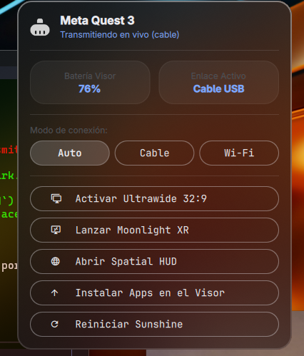

# Quest VR Link for Omarchy (`quest-vr-link`)

<p align="center">
  <br>
  
</p>
Una suite completa y modular para integrar el **Meta Quest 3** con **Omarchy Linux / Hyprland**:
streaming de ultra baja latencia de doble vía (**Cable USB con reverse tethering** o **Wi-Fi LAN inalámbrico**), monitor virtual **Ultrawide 32:9 (3840x1080@90Hz)**, auto-lanzador inteligente y un **Spatial HUD flotante** para realidad mixta (Passthrough).

---

## Características

- 󰄛 **Widget nativo de barra en Omarchy (Quickshell)**:
  - Telemetría en vivo del visor: nivel de batería, estado de transmisión y tipo de enlace activo.
  - Selector de modo: **Auto** (Plug & Play inteligente), **Cable USB** forzado o **Wi-Fi LAN**.
  - Alternador con un solo clic o atajo (`SUPER + ALT + V`) entre monitor físico 16:9 y **Ultrawide virtual 32:9**.
  - Botón de instalación automática de apps en el visor en un solo paso.
  - Lanzadores directos para Moonlight XR y Spatial HUD en el visor vía ADB.
- 🔌 **Doble vía de conexión (Cable USB o Wi-Fi)**:
  - **Modo Auto (Plug & Play)**: Si el cable USB está enchufado, usa el túnel de cable ultrarrápido (`10.0.2.2`); si se desconecta el cable, conmuta automáticamente a la red Wi-Fi local sin configuración manual.
  - **Modo Cable**: Prioriza latencia mínima (<1ms de red) y encapsula paquetes UDP vía Gnirehtet.
  - **Modo Wi-Fi**: Conexión inalámbrica libre por la red local a través de la IP de la laptop.
- 🚀 **Ciclo de vida automático y eficiente (udev & systemd)**:
  - **Al conectar el cable**: udev detecta el visor, levanta los servicios auxiliares (`gnirehtet`, `spatial-hud`, `vr-ttyd`) y abre automáticamente el HUD y Moonlight XR.
  - **Al desconectar el cable**: udev dispara de inmediato el apagado automático de los servicios (`quest-cleanup.service`), liberando CPU y memoria de la laptop y restaurando el monitor si el modo Ultrawide estaba activo.
- 🌌 **Spatial HUD (Realidad Mixta / Passthrough)**:
  - Panel web flotante con tema translúcido oscuro (`http://10.0.2.2:9090`):
    1. **Métricas completas de PC**: CPU (uso, frec, temp), GPU Iris Xe (actividad, frec, temp die), RAM, consumo de batería en Watts y tráfico de red en vivo (I/O).
    2. **Terminal interactiva**: Embebida con `ttyd` (puerto 7681) y barra de teclas táctiles (`Ctrl`, `Alt`, `Esc`, `Tab`, `^C`, `^D`, flechas direccionales).
    3. **Pomodoro espacial**: Temporizador de enfoque (25m / 5m) con controles táctiles en VR.
    4. **Notificaciones**: Interceptor en tiempo real de alertas de escritorio vía D-Bus.
---

## Arquitectura

```
  [ Meta Quest 3 ]                                        [ PC / Hyprland ]
┌────────────────────────┐                             ┌─────────────────────────┐
│ Moonlight XR (Video)   │ ◄─── UDP Stream (VA-API) ───┤ Sunshine (eDP-1/HEADLESS│
│ Quest Browser (HUD)    │ ◄─── HTTP (10.0.2.2:9090) ──┤ Spatial HUD Server      │
│ App Gnirehtet (VPN)    │ ◄─── Túnel USB / ADB ───────┤ Gnirehtet Daemon        │
└────────────────────────┘                             └─────────────────────────┘
```

---

## Requisitos y Preparación del Visor (Meta Quest)

### 1. Activar el Modo Desarrollador en el Quest
1. Abre la aplicación **Meta Horizon** en tu teléfono móvil emparejado con el visor.
2. Ve a **Menú** ➔ **Dispositivos** ➔ Selecciona tu Meta Quest 3.
3. Entra en **Ajustes de auriculares** ➔ **Modo Desarrollador**.
4. Activa la casilla **Modo Desarrollador** (si es tu primera vez, Meta te pedirá registrar una organización gratuita con verificación de dos pasos o tarjeta).

### 2. Permitir la Depuración USB (ADB)
1. Conecta el Meta Quest 3 a la laptop con un cable USB-C de datos.
2. **Ponte el visor**: aparecerá una ventana emergente en el visor diciendo:
   > *"¿Permitir depuración por USB desde esta computadora?"*
3. Marca la casilla **"Permitir siempre desde esta computadora"** y presiona **Permitir**.
4. Verifica en tu terminal de Linux:
   ```bash
   adb devices
   ```
   Deberás ver tu número de serie con el estado `device`.

---

## Instalación en la PC

### Opción A: Vía `omarchy plugin add` (Recomendado)
```bash
omarchy plugin add https://github.com/rotsen93/omarchy-quest-vr.git --enable
~/.config/omarchy/plugins/quest-vr-link/install.sh
```

### Opción B: Clon manual desde Git
```bash
git clone https://github.com/rotsen93/omarchy-quest-vr.git
cd omarchy-quest-vr
./install.sh
```

### Ubicación en la barra
Para mover el widget a la sección deseada:
```bash
omarchy bar move quest-vr-link --section right
```
---

## Instalación Automática en el Visor

Una vez que el visor esté conectado por USB y con ADB autorizado, puedes instalar todo el software del visor en un solo paso:

1. **Desde la barra de Omarchy**:
   - Haz clic en el icono del visor (󰄛) en la barra.
   - Presiona el botón **"Instalar Apps en el Visor"**.

2. **O desde la terminal**:
   ```bash
   ~/.local/bin/quest-install-headset
   ```

Esto descargará e instalará automáticamente:
- El cliente **Gnirehtet** (para el túnel IP por cable USB sin Wi-Fi).
- El cliente oficial **Moonlight XR** (para streaming OpenXR de ultra baja latencia).

---

## Primer Uso

1. Conecta el cable USB a la laptop (el auto-lanzador abrirá el HUD y Moonlight XR de forma automática).
2. En el visor, acepta la solicitud de **Conexión VPN** (túnel local seguro de Gnirehtet).
3. En Moonlight XR añade la IP `10.0.2.2`.
4. Empareja el PIN de 4 dígitos en el navegador de tu laptop en `https://localhost:47990`.

---

## Desinstalación limpia

Para retirar el plugin y todos sus servicios sin dejar residuos:
```bash
./uninstall.sh
omarchy plugin remove quest-vr-link
```
---

## Créditos y Autoría

- **Autor**: Nestor (`@rotsen93`)
- Construido con y para la comunidad de [Omarchy Linux](https://omarchy.org).

---

## Licencia

Distribuido bajo la licencia [MIT](LICENSE).
